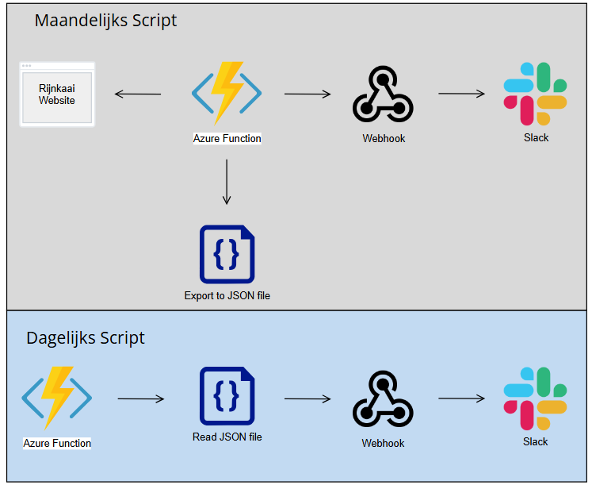

# Rijnkaai App

## Functions

Available Azure Functions:
- GetClosingTimes
- DailyNotification

### GetClosingTimes

GetClosingTimes function is an Timer based Azure Function planned to run at midnight on the first of every month to update the schdeule of when Rijnkaai is closed.

It does this by calling an API that the [Antwerp Rijnkaai Parking website](https://www.slimnaarantwerpen.be/nl/auto-taxi/publieke-parkings/parking-rijnkaai) also calls and searches through the response body for the relevant information.
In the response body we look for an entry with a certian UUID, this UUID indicates the data section with the dates of when Rijnkaai is closed.

Then we filter out the dates and the description set for that date in the response, send a notification to Slack and save a .json file with the structured data in an Azure Blob Storage on our Azure environment for later use.

### DailyNotification

DailyNotification function is a Timer based Azure Function planned to run at 5 PM CET every day to check if Rijnkaai is closed the next day and if so send a Slack message in a Notification channel.

The function uses the .json file saved in the Azure Blob Storage by GetClosingTimes function and looks through the structured data to see if there is an entry matching the date of the next day, if so we can conclude that Rijnkaai is closed the next day and relay the description to Slack so we can notify the channel of when Rijnkaai is closed.

